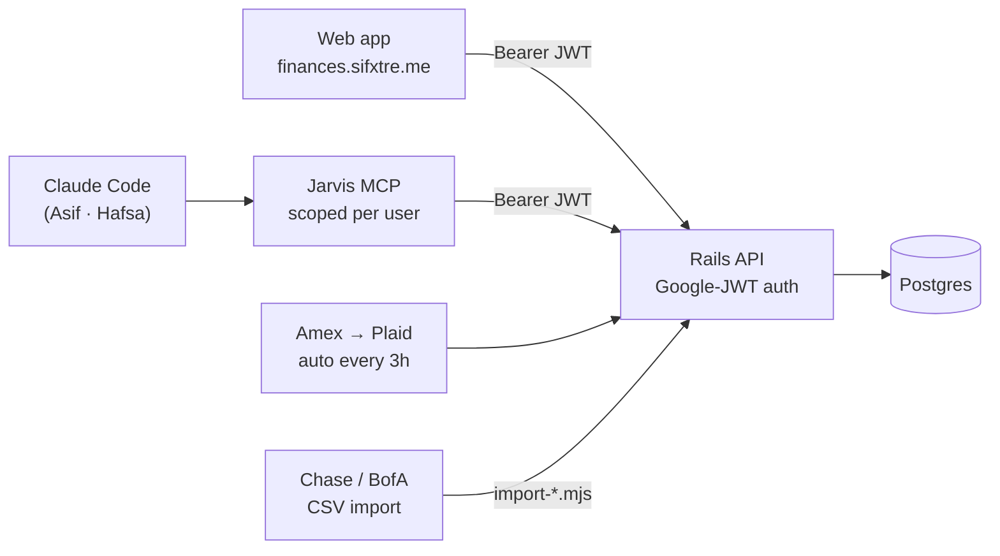
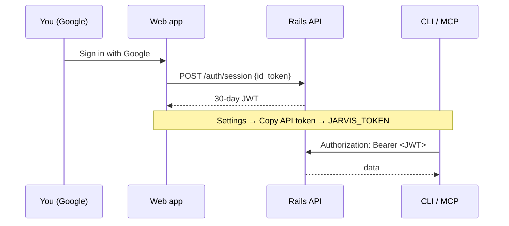

# Jarvis

A personal finance + calendar hub for Asif & Hafsa — bank sync, spending insights, budgets, and
a light personal calendar. Increasingly driven through **MCP tools** (each person's Claude Code)
rather than the web UI. See [`docs/DIRECTION.md`](docs/DIRECTION.md) for the north-star.

## Features

### Money (the core)
- **Amex** — auto-syncs every 3 hours via **Plaid** (`bank_connections` id 9).
- **Chase & BofA** — **CSV import** (`tools/import-chase.mjs` / `import-bofa.mjs`), with multiset
  `(date, amount)` + date-floor dedup so re-drops don't double-count. See
  [`docs/BANK_SYNC_PRD.md`](docs/BANK_SYNC_PRD.md).
- **Categorization** — learned-history + rules (per-person: e.g. Target→kids, Kindle→Hafsa),
  not a black-box ML model. Amazon rows are categorized by item via a separate lookup.
- **Budgets & Trends** — month-over-month by category/merchant; budget-vs-actual; missing-recurring.
- **Sync Status** (`/sync`) — surfaces *only* the accounts we actually sync and flags stale ones
  (Amex auto, Chase/BofA CSV). Ad-hoc entries (Zelle/Venmo/cash) and old closed accounts are hidden.

### Calendar (kernel only)
- **Personal** Google Calendar sync + a `/calendar` UI (day/week/2-week/month), create/update/delete.
- Frozen to the essentials — **no work calendars, no busy-blocks, no in-app chat.**

### Access
- **Auth: Google Sign-In → JWT.** The web app, the CLIs, and the MCP all authenticate with the
  same Google-issued JWT (Bearer). Allow-listed to Asif + Hafsa. No shared static key.
- **MCP server** ([`mcp/`](mcp/README.md)) — exposes scoped finance/grocery tools to Claude Code,
  per user (Asif = full, Hafsa = grocery-only).

## Architecture



```
jarvis/
├── backend/              # Rails 5.2 API + Resque workers (Postgres 14, Redis)
├── finance-tracker-app/  # React 18 + Vite + Tailwind SPA (Netlify)
├── tools/                # finance CLIs (SDK, CSV importers, grocery.mjs, analysis)
├── mcp/                  # local stdio MCP server for Claude Code
├── grocery/              # Hafsa's grocery workspace (CLAUDE.md + checklist)
└── docs/                 # DIRECTION.md, BANK_SYNC_PRD.md, …
```

| Component | Stack | Deploy |
|---|---|---|
| Backend | Rails 5.2, Postgres 14, Redis, Resque | Docker on the box (`./deploy.sh`) |
| Frontend | React 18, Vite, Tailwind, Radix | Netlify (auto on push to `master`) |

## Frontend pages

| Route | Description |
|---|---|
| `/` | Transactions — list, filters, search |
| `/trends` | Spending trends (MoM by category/merchant) |
| `/calendar` | Personal calendar (day/week/2-week/month) |
| `/yearly-budget` | Annual budget overview |
| `/sync` | **Sync status** — which accounts need a refresh |
| `/plaid-connect` | Connect Amex via Plaid |

Settings menu also has **Copy API token** (your JWT, for MCP configs).

## Auth (how tokens work)

1. Sign in at https://finances.sifxtre.me with Google → the app POSTs the Google ID token to
   `POST /api/auth/session`, which validates it and issues a **30-day JWT** (revocable via
   `jwt_sessions`).
2. The web app stores that JWT and sends it as `Authorization: Bearer <jwt>`.
3. CLIs + MCP use the **same** JWT via env `JARVIS_TOKEN` (grab it: Settings → Copy API token).



The static `JARVIS_RAILS_PASSWORD` path still exists as server-side break-glass only.

## Deploy

- **Frontend:** push to `master` → Netlify builds `finance-tracker-app/client/dist`.
- **Backend:** `./deploy.sh` → SSHes to the box and runs `update_server.sh`
  (git pull → docker build → `rake db:migrate` → docker-compose up).

## Background jobs (Resque)

| Job | Schedule | Description |
|---|---|---|
| `SyncTransactionsForBanks` | every 3h | fetch new transactions (Plaid) |
| `Finances::Predictions` | after sync | categorize new transactions |
| `SyncCalendarEvents` | every 10m | sync personal calendar events |

## Local tools

```bash
cd tools && npm install
export JARVIS_TOKEN=<your token from Settings → Copy API token>
node budget-vs-actual.mjs 2026 7      # budget vs actual
node grocery.mjs stores               # grocery spend by store
node import-chase.mjs --dry-run       # import a Chase CSV (dry run first)
```

## Removed (2026-07-25 teardown)

Web chat panel, Slack bot, Gemini extraction, the Memory feature, work-calendar/busy-block
sync, and the mobile-app prototype were all removed — replaced by the MCP surface. Their
tables were dropped and any meaningful data archived. See `docs/DIRECTION.md`.

## License

MIT
