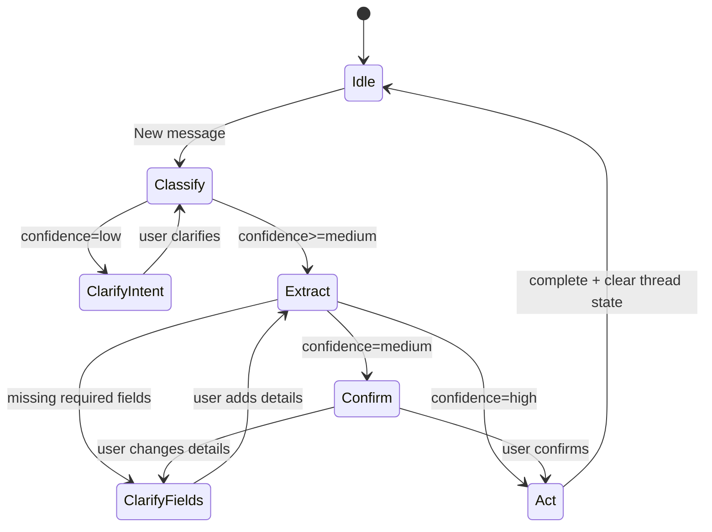

# Chat Flow Overview

This doc shows how chat requests flow through the frontend, backend, and AI services, including uploads and clarification state.

## Mermaid (System Flow)

```mermaid
flowchart TD
  User[User] --> UI[ChatWidget/ChatPanel]
  UI -->|POST /chat/messages (text/image)| API[ChatMessagesController]
  API -->|Create ChatMessage + attach image| DB[(Postgres)]
  API --> Thread[ChatThread state]
  API --> Handler[WebChatMessageHandler]

  Handler -->|Classify intent + confidence| GeminiIntent[Gemini intent model]
  Handler -->|Extract event/transaction| GeminiExtract[Gemini extract model]
  Handler -->|Clarify/confirm| Thread

  Handler -->|Create/Update/Delete event| GCal[GoogleCalendarClient]
  Handler -->|Create transaction| Txn[FinancialTransaction]

  GCal --> DB
  Txn --> DB

  API --> UIReply[Reply + action]
  UIReply -->|dispatch events| UI
  UI -->|refetch data| Pages[Calendar/Transactions/Trends/Yearly Budget]
```

## Mermaid (Clarification State)



## ASCII (System Flow)

```
User
  |
  v
ChatWidget/ChatPanel
  |
  v  POST /chat/messages (text/image)
ChatMessagesController
  |-- creates ChatMessage (+ ActiveStorage image)
  |-- loads ChatThread.state
  v
WebChatMessageHandler
  |-- intent + confidence (Gemini)
  |-- extract event/transaction (Gemini)
  |-- clarification state (ChatThread.state)
  |-- calendar ops (GoogleCalendarClient)
  |-- transaction create (FinancialTransaction)
  v
Reply (text + action)
  |
  v
UI dispatches refresh events -> Pages refetch
```

## ASCII (Clarification Loop)

```
New message
  -> classify intent (confidence)
     -> low    : ask "what do you want to do?"
     -> medium : extract + confirm
     -> high   : extract + act

Extract result
  -> missing fields: ask for specific fields
  -> ready:
     -> confirm if medium
     -> proceed if high
```
