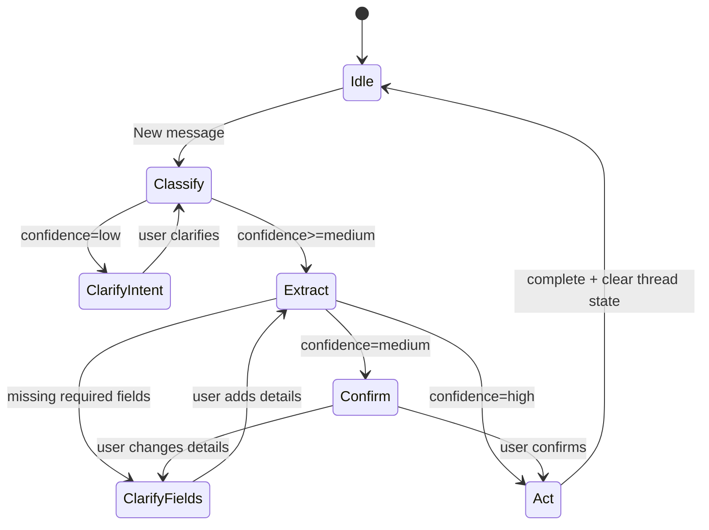

# Chat Flow Overview

This doc shows how chat requests flow through the frontend, backend, and AI services, including uploads and clarification state.

## Mermaid (System Flow)

```mermaid
flowchart TD
  User[User] --> UI[ChatWidget/ChatPanel]
  UI -->|POST /chat/messages (text/image)| API[ChatMessagesController]
  API -->|Create ChatMessage + attach image| DB[(Postgres)]
  API --> Thread[ChatThread state]
  API --> Handler[WebChatMessageHandler]
  Handler --> FlowEngine[ChatFlowEngine]
  FlowEngine --> Flows[ChatFlows (Event/Transaction/Memory)]

  Handler -->|Classify intent + confidence| GeminiIntent[Gemini intent model]
  Handler -->|Extract event/transaction| GeminiExtract[Gemini extract model]
  Handler -->|Clarify/confirm| Thread

  Handler -->|Create/Update/Delete event| GCal[GoogleCalendarClient]
  Handler -->|Create transaction| Txn[FinancialTransaction]

  GCal --> DB
  Txn --> DB

  API --> UIReply[Reply + action]
  UIReply -->|dispatch events| UI
  UI -->|refetch data| Pages[Calendar/Transactions/Trends/Yearly Budget]
```

## Mermaid (Clarification State)



## ASCII (System Flow)

```
User
  |
  v
ChatWidget/ChatPanel
  |
  v  POST /chat/messages (text/image)
ChatMessagesController
  |-- creates ChatMessage (+ ActiveStorage image)
  |-- loads ChatThread.state
  v
WebChatMessageHandler
  |-- intent + confidence (Gemini)
  |-- delegate flow (ChatFlowEngine)
ChatFlowEngine
  |-- extract/clarify/confirm/execute per flow
  |-- clarification state (ChatThread.state)
  |-- calendar ops (GoogleCalendarClient)
  |-- transaction create (FinancialTransaction)
  v
Reply (text + action)
  |
  v
UI dispatches refresh events -> Pages refetch
```

## ASCII (Clarification Loop)

```

## Backend Helper Modules

- `ChatFlowEngine` coordinates extract → clarify → confirm → execute for each capability.
- `ChatHelpers::CalendarActions` owns create/update/delete + calendar auth handling.
- `ChatHelpers::Formatters` standardizes text summaries for events, transactions, and memories.
- `ChatHelpers::AiLogging` centralizes Gemini request logging and token/cost tracking.
- `ChatHelpers::Payloads` normalizes extracted payloads and pending state merges.
- `ChatHelpers::EventHandlers`, `MemoryHandlers`, `TransactionHandlers` hold flow-specific orchestration.
- `ChatHelpers::EventQuery` centralizes fuzzy event search and list behavior.

## Plug-and-Play Guide

To add a new capability with minimal surface area:

1. Create a flow in `backend/app/lib/chat_flows/` and implement extract/confirm/execute.
2. Register it in `backend/app/lib/chat_flows/registry.rb`.
3. Add helpers in `backend/app/lib/chat_helpers/` only if logic is reused.

The handler now mostly routes to `ChatFlowEngine`, so new capabilities rarely require edits in `WebChatMessageHandler`.
New message
  -> classify intent (confidence)
     -> low    : ask "what do you want to do?"
     -> medium : extract + confirm
     -> high   : extract + act

Extract result
  -> missing fields: ask for specific fields
  -> ready:
     -> confirm if medium
     -> proceed if high
```
