# Chat State Machine Reference

This document details all pending action states in the chat system, their transitions, and the conditions that trigger each transition.

## Overview

The chat system uses a state machine stored in `ChatThread.state['pending_action']` to manage multi-turn conversations. When the system needs clarification or confirmation from the user, it sets a pending action and waits for the user's response.

## State Diagram

```mermaid
stateDiagram-v2
    direction TB

    [*] --> IDLE: Initial state

    state "Intent Classification" as CLASSIFY {
        IDLE --> clarify_image_intent: Image with low confidence
        IDLE --> clarify_intent: Text with low/ambiguous intent
    }

    state "Event Creation Flow" as EVENT_CREATE {
        IDLE --> clarify_event_fields: Missing title/date
        IDLE --> confirm_event: Medium confidence, all fields present
        IDLE --> select_event_from_extraction: Multiple events extracted
        clarify_event_fields --> clarify_event_fields: Still missing fields
        clarify_event_fields --> confirm_event: All fields, medium confidence
        clarify_event_fields --> IDLE: All fields, high confidence (execute)
        select_event_from_extraction --> clarify_event_fields: Selected event missing fields
        select_event_from_extraction --> IDLE: Execute selected events
        confirm_event --> IDLE: User confirms (execute)
        confirm_event --> IDLE: User declines
    }

    state "Event Update Flow" as EVENT_UPDATE {
        IDLE --> clarify_update_changes: No changes specified
        IDLE --> clarify_update_target: No target event identified
        IDLE --> select_event_for_update: Multiple matching events
        IDLE --> clarify_recurring_scope: Recurring event, scope unclear
        IDLE --> confirm_update: Medium confidence update
        clarify_update_changes --> clarify_update_target: Changes provided, no target
        clarify_update_changes --> confirm_update: Changes + target resolved
        clarify_update_target --> select_event_for_update: Multiple matches
        clarify_update_target --> confirm_update: Single match
        select_event_for_update --> clarify_recurring_scope: Selected recurring event
        select_event_for_update --> confirm_update: Selected non-recurring
        clarify_recurring_scope --> IDLE: Scope provided (execute)
        confirm_update --> IDLE: User confirms (execute)
        confirm_update --> IDLE: User declines
    }

    state "Event Delete Flow" as EVENT_DELETE {
        IDLE --> clarify_delete_target: No target identified
        IDLE --> select_event_for_delete: Multiple matching events
        IDLE --> clarify_recurring_scope: Recurring event, scope unclear
        IDLE --> confirm_delete: Event identified
        clarify_delete_target --> select_event_for_delete: Multiple matches
        clarify_delete_target --> confirm_delete: Single match
        select_event_for_delete --> clarify_recurring_scope: Selected recurring event
        select_event_for_delete --> confirm_delete: Selected non-recurring
        confirm_delete --> IDLE: User confirms (execute)
        confirm_delete --> IDLE: User declines
    }

    state "Event List Flow" as EVENT_LIST {
        IDLE --> clarify_list_query: Empty results or unclear query
        clarify_list_query --> IDLE: Query resolved
    }

    state "Transaction Creation Flow" as TXN_CREATE {
        IDLE --> clarify_transaction_fields: Missing merchant/amount/date/source
        IDLE --> confirm_transaction: Medium confidence, all fields present
        IDLE --> select_transaction_from_extraction: Multiple transactions extracted
        clarify_transaction_fields --> clarify_transaction_fields: Still missing fields
        clarify_transaction_fields --> confirm_transaction: All fields, medium confidence
        clarify_transaction_fields --> IDLE: All fields, high confidence (execute)
        select_transaction_from_extraction --> clarify_transaction_fields: Selected missing fields
        select_transaction_from_extraction --> IDLE: Execute selected transactions
        confirm_transaction --> IDLE: User confirms (execute)
        confirm_transaction --> IDLE: User declines
    }

    state "Memory Creation Flow" as MEMORY_CREATE {
        IDLE --> clarify_memory_fields: Missing content
        IDLE --> confirm_memory: Medium confidence
        clarify_memory_fields --> confirm_memory: Content provided
        clarify_memory_fields --> IDLE: Content provided, high confidence (execute)
        confirm_memory --> IDLE: User confirms (execute)
        confirm_memory --> IDLE: User declines
    }

    clarify_image_intent --> EVENT_CREATE: User says "event"
    clarify_image_intent --> TXN_CREATE: User says "transaction"
    clarify_image_intent --> MEMORY_CREATE: User says "memory"
    clarify_intent --> EVENT_CREATE: User clarifies event
    clarify_intent --> TXN_CREATE: User clarifies transaction
    clarify_intent --> MEMORY_CREATE: User clarifies memory
    clarify_intent --> EVENT_DELETE: User clarifies delete
    clarify_intent --> EVENT_UPDATE: User clarifies update
```



## State Reference Table

### Intent Classification States

| State | Trigger | User Response | Next State |
|-------|---------|---------------|------------|
| `clarify_image_intent` | Image uploaded, can't determine if event/transaction | "event", "transaction", "memory" | Routes to appropriate flow |
| `clarify_intent` | Text/image with low confidence or ambiguous intent | Clarification text | Routes to appropriate flow |

### Event Creation States

| State | Trigger | Payload | User Response | Next State |
|-------|---------|---------|---------------|------------|
| `clarify_event_fields` | Missing title or date | `{ event: {...}, missing_fields: [...], image_message_id? }` | Provide missing info | `confirm_event` or execute |
| `confirm_event` | All fields present, medium confidence | `{ event: {...}, image_message_id? }` | "yes" / "no" / corrections | Execute or back to clarify |
| `select_event_from_extraction` | Multiple events found in image/text | `{ events: [...], image_message_id? }` | "1,2" or "all" | Execute selected or clarify |

### Event Update States

| State | Trigger | Payload | User Response | Next State |
|-------|---------|---------|---------------|------------|
| `clarify_update_changes` | No changes specified | `{ target: {...} }` | Describe changes | `clarify_update_target` or `confirm_update` |
| `clarify_update_target` | No target event identified | `{ changes: {...} }` | Event title/date | `select_event_for_update` or `confirm_update` |
| `select_event_for_update` | Multiple events match query | `{ candidates: [...], changes: {...} }` | Number selection | `clarify_recurring_scope` or `confirm_update` |
| `clarify_recurring_scope` | Recurring event, scope unclear | `{ event_id, changes, snapshot, action: 'update' }` | "this" or "all" | Execute |
| `confirm_update` | Event + changes ready, medium confidence | `{ event_id, changes, snapshot }` | "yes" / "no" | Execute or cancel |

### Event Delete States

| State | Trigger | Payload | User Response | Next State |
|-------|---------|---------|---------------|------------|
| `clarify_delete_target` | No target event identified | `{}` | Event title/date | `select_event_for_delete` or `confirm_delete` |
| `select_event_for_delete` | Multiple events match query | `{ candidates: [...] }` | Number selection | `clarify_recurring_scope` or `confirm_delete` |
| `clarify_recurring_scope` | Recurring event, scope unclear | `{ event_id, snapshot, action: 'delete' }` | "this" or "all" | Execute |
| `confirm_delete` | Event identified | `{ event_id, snapshot, recurring_scope? }` | "yes" / "no" | Execute or cancel |

### Event List States

| State | Trigger | Payload | User Response | Next State |
|-------|---------|---------|---------------|------------|
| `clarify_list_query` | No results or unclear query | `{ query: {...} }` | Refine search | Execute query or stay |

### Transaction Creation States

| State | Trigger | Payload | User Response | Next State |
|-------|---------|---------|---------------|------------|
| `clarify_transaction_fields` | Missing merchant/amount/date/source | `{ transaction: {...}, missing_fields: [...], image_message_id? }` | Provide missing info | `confirm_transaction` or execute |
| `confirm_transaction` | All fields present, medium confidence | `{ transaction: {...}, image_message_id? }` | "yes" / "no" / corrections | Execute or back to clarify |
| `select_transaction_from_extraction` | Multiple transactions in image | `{ transactions: [...], image_message_id? }` | "1,2" or "all" | Execute selected or clarify |

### Memory Creation States

| State | Trigger | Payload | User Response | Next State |
|-------|---------|---------|---------------|------------|
| `clarify_memory_fields` | Missing content | `{ memory: {...}, force_content?, category?, image_message_id? }` | Provide content | `confirm_memory` or execute |
| `confirm_memory` | Content present, medium confidence | `{ memory: {...} }` | "yes" / "no" | Execute or cancel |

## State Transitions in Code

### Entry Points (from IDLE)

```
process!
  |
  +-- pending_action? --> handle_pending_action()
  |
  +-- classify_intent() --> intent_for_message
       |
       +-- confidence = low --> ask_image_intent / ask_intent_clarification
       |
       +-- create_event --> handle_create_event() --> flow_engine.handle_create(:event)
       +-- update_event --> handle_update_event()
       +-- delete_event --> handle_delete_event()
       +-- create_transaction --> handle_create_transaction() --> flow_engine.handle_create(:transaction)
       +-- create_memory --> handle_create_memory() --> flow_engine.handle_create(:memory)
       +-- list_events --> handle_list_events()
       +-- search_memory --> handle_search_memory()
```

### Flow Engine State Transitions

```
flow_engine.handle_create(kind)
  |
  +-- preflight? --> execute immediately (memory: image-only, link-only)
  |
  +-- extract()
  |    |
  |    +-- multi_items? --> set_pending_action(multi_action) [select_*_from_extraction]
  |    |
  |    +-- error? --> set_pending_action(clarify_action) [clarify_*_fields]
  |
  +-- missing_fields? --> set_pending_action(clarify_action) [clarify_*_fields]
  |
  +-- confidence != high --> set_pending_action(confirm_action) [confirm_*]
  |
  +-- execute()
```

### Override Detection

When a pending action exists, the system checks if the user wants to start a new task:

```
should_override_pending_action?
  |
  +-- decide_pending_action() via Gemini
       |
       +-- decision = 'continue' --> handle existing pending action
       +-- decision = 'override' --> clear state, process as new intent
```

## File Locations

| Component | File |
|-----------|------|
| State management | `backend/app/lib/chat_helpers/state.rb` |
| Pending action handlers | `backend/app/lib/web_chat_message_handler.rb:182-227` |
| Flow engine | `backend/app/lib/chat_flow_engine.rb` |
| Event handlers | `backend/app/lib/chat_helpers/event_handlers.rb` |
| Confirmation handlers | `backend/app/lib/chat_helpers/confirmations.rb` |
| Intent handlers | `backend/app/lib/chat_helpers/intent_handlers.rb` |
| Transaction handlers | `backend/app/lib/chat_helpers/transaction_handlers.rb` |
| Memory handlers | `backend/app/lib/chat_helpers/memory_handlers.rb` |
| Event candidate flow | `backend/app/lib/chat_helpers/event_candidates.rb` |

## Common Patterns

### Clarify -> Confirm -> Execute

Most flows follow this pattern:
1. **Clarify**: Ask for missing required fields
2. **Confirm**: Show extracted data and ask for confirmation (if confidence != high)
3. **Execute**: Perform the action and clear state

### Selection Pattern

When multiple items are found:
1. Show numbered list to user
2. User replies with numbers ("1,2") or "all"
3. Execute selected items

### Recurring Event Pattern

For recurring events, an additional scope clarification step is inserted:
1. Identify event
2. Ask "this event or all?" if recurring
3. Proceed with confirmation or execution

## Debugging Tips

1. **Check thread state**: `ChatThread.find(id).state` shows current pending action and payload
2. **AI logging**: `AiRequest` table logs all Gemini calls with intent/extraction results
3. **Action logging**: `ChatAction` table logs all executed actions with metadata
4. **Correlation ID**: Each request gets a `@correlation_id` for tracing through logs

## Known Issues / Tech Debt

1. **Update/Delete flows don't use ChatFlowEngine** - They have parallel implementations in `event_handlers.rb`
2. **`:event` key used for all extraction results** - Even for transactions and memories (legacy naming)
3. **No explicit state machine library** - Transitions are implicit in handler code
4. **Race conditions possible** - Concurrent requests could clobber thread state
